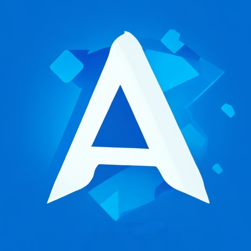

# Are Ace
[kodi][kodi] [Ace stream][ace-stream] addon, can fetch events from [Telegram][telegram] channel.

## 🇺🇦 Help Ukraine
I woke up on my 26th birthday at 5 am from the blows of russian missiles. They attacked the city of Kyiv, where I live, as well as the cities in which my family and friends live. Now my country is a war zone. 

We fight for democratic values, freedom, for our future! Once again Ukrainians have to stand against evil, terror, against genocide. The outcome of this war will determine what path human history is taking from now on.

💛💙  Help Ukraine! We need your support! There are [dozen ways][ukr-link] to help us, just do it!

## Table of Contents
- [Are Ace](#are-ace)
  - [🇺🇦 Help Ukraine](#-help-ukraine)
  - [Table of Contents](#table-of-contents)
  - [About](#about)
  - [Usage](#usage)
    - [Telegram](#telegram)
  - [Legal Notice](#legal-notice)

## About
Experience the ultimate sports streaming solution with 'Areace.' This addon scours Telegram channels for live sports event links, making it a breeze to watch your favorite games in high quality through the Acestream player.

## Usage

### Telegram
To use the Telegram provider, follow these steps:

  1. Register a [Telegram bot](https://t.me/botfather).
  2. In the 'Are Ace' settings, enable Telegram and enter your Telegram token.
  3. Add the bot to the channel where links to broadcasts are posted.
  4. Receive the links directly in Kodi for seamless access to your favorite sports events.

## Legal Notice

This addon, referred to as "Areace," is intended solely for legal and legitimate purposes. It is designed to provide users with a convenient and efficient means of accessing sports events, broadcasts, and streams in a manner consistent with applicable laws and regulations.

Users of "Areace" are explicitly reminded that they must use this addon only for lawful and authorized purposes. Specifically, "Areace" is to be employed with legally obtained and authorized sports broadcasts, and it is encouraged that users take the initiative to share their own legally acquired broadcasts with others.

The owner and developer of the "Areace" addon hereby disclaim any and all responsibility and liability for any misuse, improper use, or illegal use of the addon to access or view pirated, unauthorized, or copyrighted content. Users are entirely responsible for ensuring that their usage of "Areace" complies with all local, national, and international laws and regulations governing media and broadcasting.

By using the "Areace" addon, you acknowledge and agree to use it exclusively in accordance with the law and in a manner that respects the rights of content creators, broadcasters, and copyright holders. Any unauthorized or illegal use of the addon is strictly prohibited and may result in legal consequences.

The "Areace" addon is intended to promote lawful access to sports events and related content, and any misuse or abuse of the addon for illegal purposes is strongly discouraged and not condoned.

For questions, concerns, or additional information, please contact the addon owner or developer.

[ukr-badge]: https://img.shields.io/badge/made_in-ukraine-ffd700.svg?labelColor=0057b7
[ukr-link]: https://war.ukraine.ua
[kodi]: https://kodi.tv/
[ace-stream]: https://www.acestream.org
[telegram]: https://web.telegram.org/